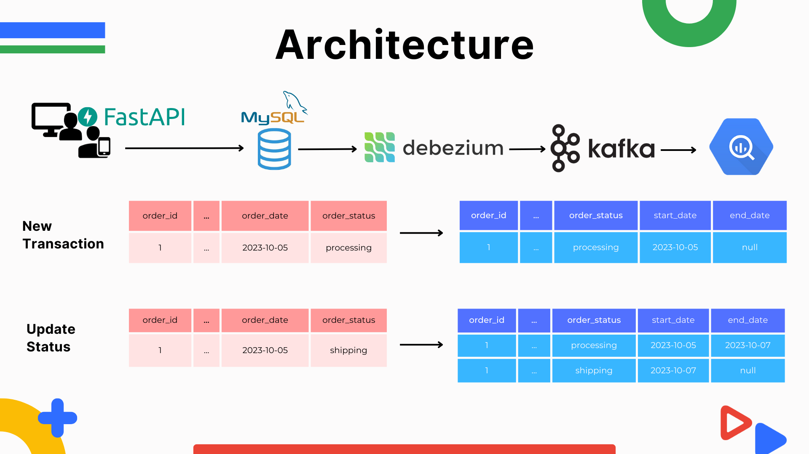

# Change Data Capture from RDBMS (MySQL) to Data Warehouse (BigQuery)

## Architecture



## How to build
- Clone the project 

    ```bash
    git clone https://github.com/ArkanNibrastama/cdc-mysql-bigquery.git
    ```
- Install all the dependencies

    ```bash
    pip install -r requirements.txt
    ```
- Build all the containers

    ```bash
    docker-compose up -d
    ```
- Create database on mysql container, you can   use universal database tool like DBeaver to create database, or you can go to mysql container > terminal then type

    ```bash
    mysql -u root -p 123
    ```
    then 

    ```bash
    CREATE DATABASE expedition;
    ```

- Run the API
    ```bash
    uvicorn orderAPI:api --reload
    ```

- Make a Debezium connector

    ```json
    {
        "name": "expedition-order-connector",  
        "config": {  
            "connector.class": "io.debezium.connector.mysql.MySqlConnector",
            "tasks.max": "1",  
            "database.hostname": "mysql",  
            "database.port": "3306",
            "database.user": "root",
            "database.password": "123",
            "database.server.id": "184054",
            "topic.prefix": "source",  
            "database.include.list": "expedition",  
            "schema.history.internal.kafka.bootstrap.servers": "kafka:9092",  
            "schema.history.internal.kafka.topic": "schemahistory.expedition",
            "transforms" : "unwrap",
            "transforms.unwrap.type" : "io.debezium.transforms.ExtractNewRecordState",
            "key.converter.schemas.enable": "false",
            "value.converter.schemas.enable": "false",
            "value.converter": "org.apache.kafka.connect.json.JsonConverter",
            "key.converter": "org.apache.kafka.connect.json.JsonConverter"
        }
    }
    ```
    make an API request (POST) and fill the header with JSON configuration below.

- Check the topics
    ```bash
    python topics.py
    ```
    if there is no source.expedition.order topic, try to create new data on the API then try to run this code again.

- Send data into BigQuery by run consumer.py, before that make sure to add the service account json file and create expedition dataset on BigQuery
    ```bash
    python consumer.py
    ```

## Full explanation
To make better understand of this repository, you can check my Medium post about this project [CDC and SCD Approach to Enhancing Expedition Operations](https://medium.com/@arkan6040nibrastama/cdc-and-scd-approach-to-enhancing-expedition-operations-3a75256c2b74).